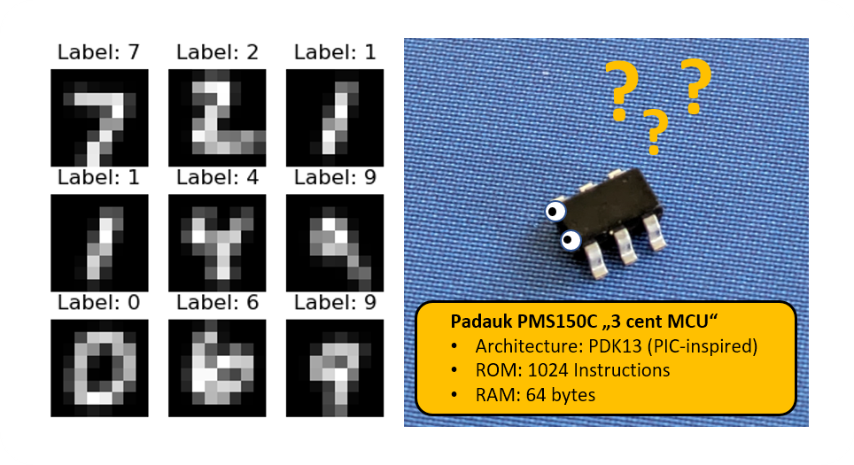

# MNIST inference on the "3 cent" PMS150C Microcontroller.

This project attempts to push [BitNetMCU](https://github.com/cpldcpu/BitNetMCU) to the absolute limit: Is it possible to implement reasonably accurate inference of MNIST, the handwritten numbers dataset, on a "3 cent" Microcontroller with only 64 bytes of RAM and 1K of instruction memory? 



Only weeks ago, my resounding answer would have been: "NO". But after the surprisingly good performance of BitNetMCU, I decided to give it a try. 

This code achieves 90.1% test accuracy on test images scaled to 8x8 pixels while consuming 59 of 64 bytes of RAM and 972 of 1024 words of program memory. [See blog](https://cpldcpu.wordpress.com/2024/05/02/machine-learning-mnist-inference-on-the-3-cent-microcontroller/) for a few more details. The training code can be found in [this branch](https://github.com/cpldcpu/BitNetMCU/tree/pdk) of BitNetMCU

## Project structure

```plaintext
├── include/                    # Contains the free-pdk header files
└── src/                
    ├── BitNetMCU_model.h       # MNIST model definition 
    ├── main.c                  # Main source file
    ├── Makefile
    ├── PDK_softuart.c          # Software UART implementation
    └── softuart.h              # Software UART header file
```
    
## Building Instructions

!!! **Use SDCC 4.1.0 to build. Later versions create broken code** !!!

To build the project, you need to have the [FreePDK toolchain](https://free-pdk.github.io/) installed. The default target is the PFS154, but you can change it to the PMS150C by editing the makefile. Currently, monitoring output is only supported with PFS154 as a target and the UART functions will not be included if PMS150C is selected.

1. Navigate to the `src/` directory.
2. Run `make flash` to build and flash the project
3. `make start` to start the monitor
